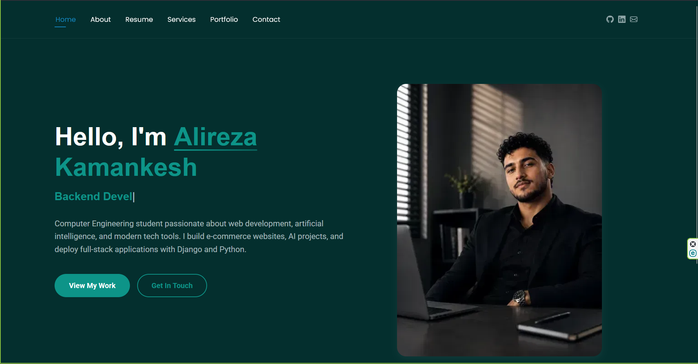

# 🌐 Alireza Kamankesh - Personal Portfolio

<div align="center">


**My professional portfolio website built with Django, optimized for performance and SEO.**

[Live Demo](https://alirezakamankesh.pythonanywhere.com) · [Report Bug](https://github.com/kamankeshalireza/mysite/issues) · [Request Feature](https://github.com/kamankeshalireza/mysite/issues)

</div>

---

## 📸 Screenshots

<div align="center">

### 🖥️ Desktop View


### 📱 Mobile View


</div>

---

## ✨ Features

### 🎯 Core Features
- **Professional Portfolio** - Showcase your work, skills, and experience
- **Bilingual Support** - English & Persian (Farsi) with django-modeltranslation
- **Responsive Design** - Fully optimized for all devices (mobile, tablet, desktop)
- **Dark/Light Theme** - Clean and modern design
- **Smooth Animations** - AOS (Animate On Scroll) library integration
- **Interactive Elements** - Typed.js text animation, Swiper sliders, GLightbox

### 📊 SEO & Performance
- **SEO Score: 79/100** (Above average of top 100 sites at 75)
- **LCP (Largest Contentful Paint): 0.44s** (Google recommends < 2.5s)
- **TTFB (Time To First Byte): 0.018s** (Google recommends < 0.8s)
- **FCP (First Contentful Paint): 0.44s** (Google recommends < 1.8s)
- **CLS (Cumulative Layout Shift): 0.0001** (Google recommends < 0.1)
- Meta tags optimized for Google, Open Graph, and Twitter Cards
- JSON-LD Structured Data (Schema.org Person markup)
- XML Sitemap auto-generation
- Canonical URLs to prevent duplicate content
- Custom 404 error page
- Google Analytics integration

### 🔒 Security
- HTTPS enforced
- CSRF protection
- XSS protection headers
- Content-Type sniffing prevention
- Clickjacking protection (X-Frame-Options)
- HSTS (HTTP Strict Transport Security) headers
- Secure cookie transmission

### ⚡ Performance Optimizations
- CDN integration (jsDelivr) for faster global delivery
- Render-blocking resources eliminated
- Deferred JavaScript loading
- CSS preloading for non-critical styles
- WebP image format for smaller file sizes
- Cache headers for static assets
- Minified CSS and JavaScript
- GZIP compression enabled
- Total page size: ~530 KB

---

## 🛠️ Tech Stack

### Backend
-  - Web framework
-  - Programming language
-  - Database (Development)
-  - Database (Production)

### Frontend
-  - CSS framework
-  - Scroll animations
-  - Typing animation
-  - Touch slider
-  - Lightbox gallery

### DevOps & Tools
-  - Hosting
-  - Version control
-  - CDN
-  - Analytics

---

## 🚀 Quick Start

### Prerequisites
- Python 3.10+
- pip (Python package manager)
- Git (optional)

### Local Installation

1. **Clone the repository**
   ```bash
   git clone https://github.com/kamankeshalireza/mysite.git
   cd mysite

Create virtual environment
python -m venv venv

# Windows
venv\Scripts\activate

# Linux/Mac
source venv/bin/activate
Install dependencies
pip install -r requirements.txt
Apply migrations
python manage.py makemigrations
python manage.py migrate
Create superuser (for admin panel)
python manage.py createsuperuser
Collect static files
python manage.py collectstatic --noinput
Run the server
python manage.py runserver
Open browser

Website: http://127.0.0.1:8000/

Admin: http://127.0.0.1:8000/admin/

📁 Project Structure
mysite/
├── blog/                    # Main application
│   ├── models.py           # Database models
│   ├── views.py            # View functions
│   ├── urls.py             # URL routing
│   ├── admin.py            # Admin configuration
│   └── sitemaps.py         # Sitemap generation
├── mysite/                  # Project configuration
│   ├── settings.py         # Django settings
│   ├── urls.py             # Root URL configuration
│   └── wsgi.py             # WSGI deployment
├── static/                  # Static files (CSS, JS, Images)
│   └── assets/
│       ├── css/            # Stylesheets
│       ├── js/             # JavaScript files
│       ├── img/            # Images and icons
│       └── vendor/         # Third-party libraries
├── templates/               # HTML templates
│   ├── base.html           # Base template
│   ├── 404.html            # Custom error page
│   ├── blog/               # Page templates
│   └── includes/           # Header, Footer components
├── locale/                  # Translation files
│   ├── en/                 # English translations
│   └── fa/                 # Persian translations
├── media/                   # User-uploaded files
├── staticfiles/             # Collected static files
├── manage.py               # Django management script
├── requirements.txt        # Python dependencies
└── .env                    # Environment variables


📊 SEO Performance
Metric	Score	Status
Overall SEO	79/100	✅ Above Average
Common SEO	92/100	✅ Excellent
Speed Optimization	73/100	✅ Good
Mobile Usability	100/100	✅ Perfect
Advanced SEO	69/100	✅ Satisfactory
Core Web Vitals
Metric	Value	Google Benchmark
LCP	0.44s	< 2.5s ✅
FCP	0.44s	< 1.8s ✅
TTFB	0.018s	< 0.8s ✅
CLS	0.0001	< 0.1 ✅
🌍 Supported Languages
🇬🇧 English (Default)

🇮🇷 Persian (Farsi)

Language switcher available in the UI. Translations managed with django-modeltranslation.

🔜 Upcoming Features
Blog section with markdown support

Contact form with email notifications

Dark mode toggle

Project case studies

Testimonials section

Progressive Web App (PWA) support

Automated SEO audits

Docker containerization

🤝 Contributing
Contributions are welcome! Here's how you can help:

Fork the repository

Create your feature branch (git checkout -b feature/AmazingFeature)

Commit your changes (git commit -m 'Add some AmazingFeature')

Push to the branch (git push origin feature/AmazingFeature)

Open a Pull Request

📝 License
This project is licensed under the MIT License - see the LICENSE file for details.

📞 Contact
Alireza Kamankesh

https://img.shields.io/badge/Website-alirezakamankesh.pythonanywhere.com-blue
https://img.shields.io/badge/LinkedIn-alireza--kamankesh-0077B5?logo=linkedin
https://img.shields.io/badge/GitHub-kamankeshalireza-181717?logo=github
https://img.shields.io/badge/Email-kamankeshalireza30@gmail.com-D14836?logo=gmail

🙏 Acknowledgments
BootstrapMade - Original template design

Django - The web framework for perfectionists with deadlines

PythonAnywhere - Free hosting for Python applications

jsDelivr - Free CDN for open source projects

SEO Site Checkup - SEO analysis tool

<div align="center">
⭐ Star this repo if you found it useful! ⭐

Made with ❤️ by Alireza Kamankesh

</div> ```
